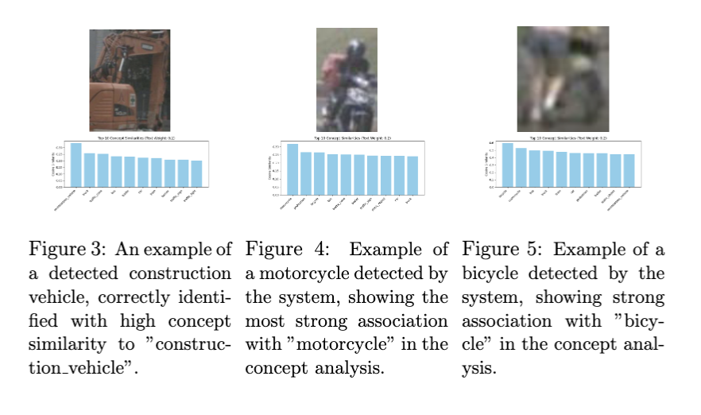
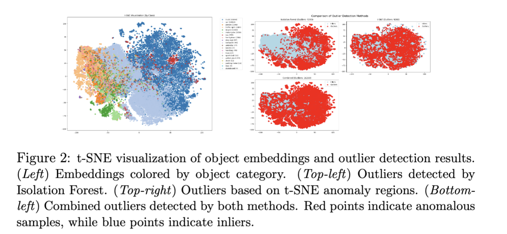
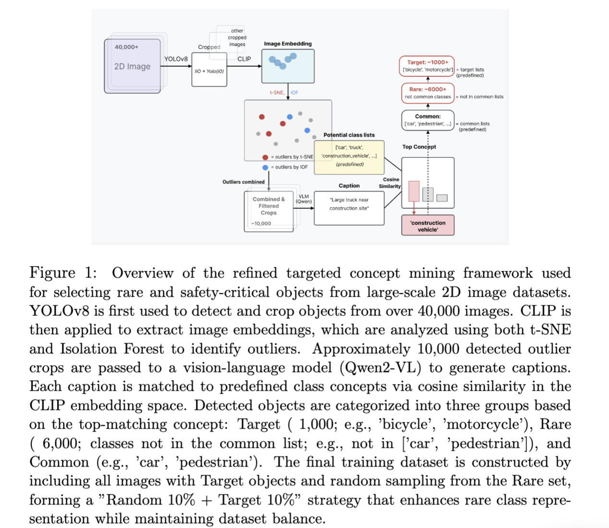
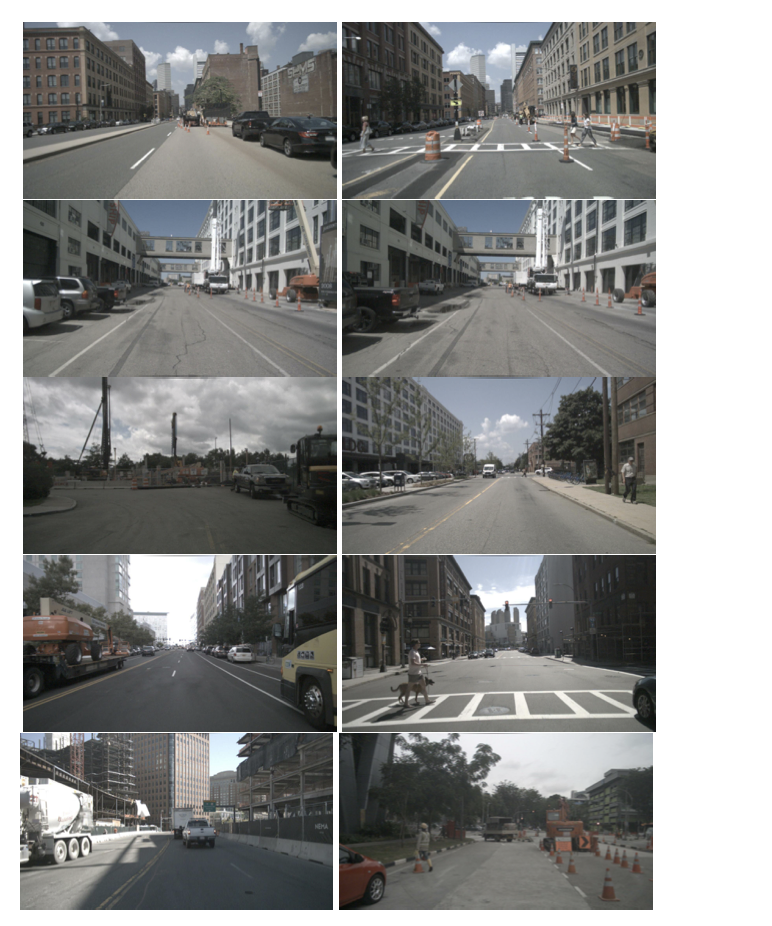

# Concept-based Explainable Data Mining with VLM for 3D Detection

A cross-modal data‐mining pipeline that leverages 2D Vision–Language Models (VLMs) to mine rare and safety-critical objects from driving scenes, and uses them to improve 3D object detection performance on point-cloud data.  See details for "paper" folder.
Implementation is in "projects/detect_rare_images". Main implementation: projects/detect_rare_images/vision-language-model-project

The paper is in \url{https://arxiv.org/pdf/2512.05482}.

**Key features**  
- **Object Concept Embedding**:  
  - 2D object detection and cropping with YOLOv8  
  - CLIP‐based semantic feature extraction  
  - Outlier detection via combined Isolation Forest + t-SNE  
- **Concept‐guided Filtering**:  
  - Vision–Language captioning (Qwen2-VL-2B-Instruct)  
  - Cosine similarity to predefined concept vocabulary  
  - Three-level grouping: _Common_, _Rare_, _Target_  
- **Targeted Data Mining**:  
  - Scenes containing “Target” concepts (e.g. motorcycle, bicycle)  
  - Scenes containing “Rare” concepts not in common class list  
  - Build training splits (“Random 10% + Target 10%”)  
- **Efficiency & Explainability**:  
  - Achieves 80% of full‐data performance using only 20% of nuScenes  
  - Transparent selection via caption‐based concept scores & t-SNE visualizations  
<!-- 

 -->




Detected images including rare objects (detected from nuScenes[1] training set)
<!--  -->


Citations:

[1] Caesar, Holger, et al. "nuscenes: A multimodal dataset for autonomous driving." Proceedings of the IEEE/CVF conference on computer vision and pattern recognition. 2020.
[2] Koh, Pang Wei, et al. "Concept bottleneck models." International conference on machine learning. PMLR, 2020.

## Disclaimer
This code is released for academic reproducibility only. It is provided "as is" without any guarantee of support or maintenance.  
Issues may not be actively responded to. Use at your own risk.


---
# vision-language-model-project/vision-language-model-project/README.md

# Vision Language Model Project

このプロジェクトは、画像と言語の統合を目的としたビジョン・ランゲージモデルを実装しています。特に、CLIPFeatureExtractorクラスを使用して画像やテキストの特徴ベクトルを取得し、VLMを利用して特徴量と画像キャプションを生成する新しい機能を追加しています。

## 構成

プロジェクトは以下のような構成になっています：

- `src/`: ソースコードが含まれています。
  - `models/`: モデル関連のコード。
    - `clip_extractor.py`: CLIPFeatureExtractorクラスが定義されています。
    - `vlm_processor.py`: VLMを使用して特徴量と画像キャプションを取得するための新しいクラスまたは関数が追加されます。
  - `utils/`: ユーティリティ関数が含まれています。
    - `image_processing.py`: 画像処理に関連する関数。
  - `inference/`: 推論関連のコード。
    - `captioning.py`: 画像キャプション生成に関連する関数やクラス。
- `config/`: モデルの設定ファイル。
  - `model_config.json`: モデルの設定をJSON形式で保存。
- `main.py`: アプリケーションのエントリーポイント。
- `requirements.txt`: プロジェクトの依存関係。

## インストール

依存関係をインストールするには、以下のコマンドを実行してください：

```
pip install -r requirements.txt
```

## 使用方法

プロジェクトを実行するには、`main.py`を使用します。具体的な使用方法については、各モジュールのドキュメントを参照してください。


## Usage memo
```
docker run --gpus all -d --shm-size=64g -v $PWD/:/workspace -v $(realpath ../data_nuscenes/nuscenes):/workspace/data_nuscenes blip bash -c "python projects/detect_rare_images/vision-language-model-project/main.py

```
[examples]
```
root@51b6be5b3808:/workspace# python projects/detect_rare_images/vision-language-model-project/main.py --max-images 200
プロットを英語表示に設定しました
結果は ./outlier_detection_results/outlier_detection_0502_12-27-49_JST に保存されます
設定情報: {'images_folder': './data_nuscenes/samples/CAM_FRONT', 'output_dir': './outlier_detection_results', 'qwen_model_size': '2B', 'contamination': 0.1, 'target_classes': ['construction_vehicle', 'bicycle', 'motorcycle', 'trailer', 'truck'], 'common_classes': ['car', 'pedestrian', 'traffic_light', 'traffic_sign'], 'save_crops': True, 'save_descriptions': True, 'save_probability_plots': True, 'cleanup_temp_files': False, 'max_images': 200, 'seed': 42, 'timestamp': '0502_12-27-49_JST', 'device': 'cuda:0', 'sampling_rate': 0.2, 'skip_visualization': True, 'skip_caption': True, 'parallel': False, 'workers': None, 'use_blip': True, 'process_all_blip': False, 'weight_text': 0.5}
処理対象: 200枚の画像（最大数制限）
サンプリング適用: 200枚 → 40枚 (サンプリング率: 0.2%)
オブジェクト検出と切り抜きを実行中...
オブジェクト検出進捗: 2.5% (1/40) | 経過: 0.6秒 | 残り: 0.0秒
Ultralytics YOLOv8.0.20 🚀 Python-3.10.14 torch-2.2.2+cu121 CUDA:0 (NVIDIA GeForce RTX 3090, 24260MiB)
YOLOv8l summary (fused): 268 layers, 43668288 parameters, 0 gradients, 165.2 GFLOPs
オブジェクト検出進捗: 100.0% (40/40) | 経過: 7.7秒 | 残り: 0.0秒
検出されたオブジェクト数: 231
早期フィルタリング: 231個 → 46個のオブジェクト
Using a slow image processor as `use_fast` is unset and a slow processor was saved with this model. `use_fast=True` will be the default behavior in v4.52, even if the model was saved with a slow processor. This will result in minor differences in outputs. You'll still be able to use a slow processor with `use_fast=False`.
特徴抽出を実行中...
特徴抽出進捗: 69.6% (32/46) | 経過: 0.0秒 | 残り: 0.0秒
特徴抽出進捗: 100.0% (46/46) | 経過: 0.2秒 | 残り: -0.0秒
有効な特徴ベクトル数: 46/46
t-SNE可視化をスキップします
IsolationForestによるアウトライア検出を実行中 (contamination=0.1)...
IsolationForestモデルを訓練中 (contamination=0.1)...
LOFによるアウトライア検出を実行中 (contamination=0.1)...
Isolation ForestとLOFの結果を組み合わせています (union)...
検出結果: Isolation Forest 5件, LOF 5件, 組み合わせ 8件
処理対象オブジェクト数: 46 (アウトライア: 8, 希少クラス: 46)
キャプション生成をスキップするためモデルは初期化しません
キャプション生成と最終判定を実行中...
サブバッチ処理中: 1〜46/46...
クラス別アウトライア検出を実行中...
処理が完了しました。 処理時間: 15.4秒
結果は ./outlier_detection_results/outlier_detection_0502_12-27-49_JST に保存されました。
root@51b6be5b3808:/workspace# python projects/detect_rare_images/vision-language-model-project/main.py --max-images 200
プロットを英語表示に設定しました
結果は ./outlier_detection_results/outlier_detection_0502_12-31-29_JST に保存されます
設定情報: {'images_folder': './data_nuscenes/samples/CAM_FRONT', 'output_dir': './outlier_detection_results', 'qwen_model_size': '2B', 'contamination': 0.1, 'target_classes': ['construction_vehicle', 'bicycle', 'motorcycle', 'trailer', 'truck'], 'common_classes': ['car', 'pedestrian', 'traffic_light', 'traffic_sign'], 'save_crops': True, 'save_descriptions': True, 'save_probability_plots': True, 'cleanup_temp_files': False, 'max_images': 200, 'seed': 42, 'timestamp': '0502_12-31-29_JST', 'device': 'cuda:0', 'sampling_rate': 0.2, 'skip_visualization': True, 'skip_caption': True, 'parallel': False, 'workers': None, 'use_blip': True, 'process_all_blip': False, 'weight_text': 0.25}
処理対象: 200枚の画像（最大数制限）
サンプリング適用: 200枚 → 40枚 (サンプリング率: 0.2%)
オブジェクト検出と切り抜きを実行中...
オブジェクト検出進捗: 2.5% (1/40) | 経過: 0.7秒 | 残り: 0.0秒
Ultralytics YOLOv8.0.20 🚀 Python-3.10.14 torch-2.2.2+cu121 CUDA:0 (NVIDIA GeForce RTX 3090, 24260MiB)
YOLOv8l summary (fused): 268 layers, 43668288 parameters, 0 gradients, 165.2 GFLOPs
オブジェクト検出進捗: 100.0% (40/40) | 経過: 5.8秒 | 残り: 0.0秒
検出されたオブジェクト数: 231
早期フィルタリング: 231個 → 46個のオブジェクト
Using a slow image processor as `use_fast` is unset and a slow processor was saved with this model. `use_fast=True` will be the default behavior in v4.52, even if the model was saved with a slow processor. This will result in minor differences in outputs. You'll still be able to use a slow processor with `use_fast=False`.
特徴抽出を実行中...
特徴抽出進捗: 69.6% (32/46) | 経過: 0.0秒 | 残り: 0.0秒
特徴抽出進捗: 100.0% (46/46) | 経過: 0.2秒 | 残り: -0.0秒
有効な特徴ベクトル数: 46/46
t-SNE可視化をスキップします
IsolationForestによるアウトライア検出を実行中 (contamination=0.1)...
IsolationForestモデルを訓練中 (contamination=0.1)...
LOFによるアウトライア検出を実行中 (contamination=0.1)...
Isolation ForestとLOFの結果を組み合わせています (union)...
検出結果: Isolation Forest 5件, LOF 5件, 組み合わせ 8件
処理対象オブジェクト数: 46 (アウトライア: 8, 希少クラス: 46)
キャプション生成をスキップするためモデルは初期化しません
キャプション生成と最終判定を実行中...
サブバッチ処理中: 1〜46/46...
クラス別アウトライア検出を実行中...
処理が完了しました。 処理時間: 13.5秒
結果は ./outlier_detection_results/outlier_detection_0502_12-31-29_JST に保存されました。
root@51b6be5b3808:/workspace# 
```

